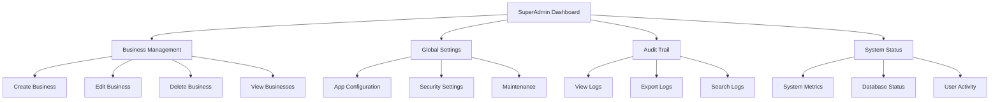
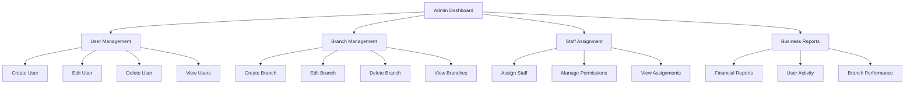
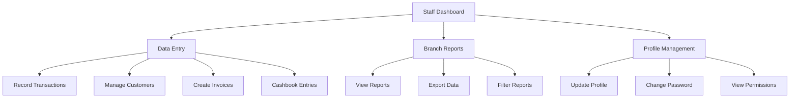

# Role-Based Access Control (RBAC) System Design

## Overview
This document outlines the design for implementing a comprehensive Role-Based Access Control (RBAC) system for a multi-business, multi-branch application with strict data isolation between businesses and branches.

## System Architecture

### Current Structure
- Multiple businesses, each containing multiple branches
- Dedicated user management per branch
- Three-tier role hierarchy: SuperAdmin, Admin, and Staff
- Complete user authentication and authorization framework

### New Branch Structure
We need to add a branches table to support the multi-branch architecture:

```sql
CREATE TABLE `branches` (
  `id` varchar(255) NOT NULL,
  `business_id` varchar(255) NOT NULL,
  `name` varchar(255) NOT NULL,
  `address` text,
  `phone` varchar(50),
  `email` varchar(255),
  `is_active` boolean DEFAULT true,
  `created_at` timestamp DEFAULT CURRENT_TIMESTAMP,
  `updated_at` timestamp DEFAULT CURRENT_TIMESTAMP ON UPDATE CURRENT_TIMESTAMP,
  PRIMARY KEY (`id`),
  KEY `ix_branches_business` (`business_id`),
  CONSTRAINT `fk_branches_business` FOREIGN KEY (`business_id`) REFERENCES `businesses` (`id`) ON DELETE CASCADE
);
```

### Updated businessUsers Table
We need to modify the businessUsers table to include branch association:

```sql
ALTER TABLE `business_users` ADD `branch_id` varchar(255);
ALTER TABLE `business_users` ADD KEY `ix_business_users_branch` (`branch_id`);
ALTER TABLE `business_users` ADD CONSTRAINT `fk_business_users_branch` FOREIGN KEY (`branch_id`) REFERENCES `branches` (`id`) ON DELETE SET NULL;
```

## Role Definitions

### SuperAdmin
- System-wide administrator with full access
- Can create/modify businesses
- Manage global data
- View application status
- Handle audit trails
- Process issues/feedback
- Maintain user manuals
- Access via /admin/login endpoint

### Admin
- Business-level administrator
- Manage all users within their business
- Manage branch data
- Assign staff to specific branches within their business

### Staff
- Branch-specific users
- Can only view, add, and generate data for their assigned branch

## Permissions Model

### Role Hierarchy
```
SuperAdmin
└── Admin
    └── Staff
```

### Permission Matrix

| Feature | SuperAdmin | Admin | Staff |
|---------|------------|-------|-------|
| Create/Modify Businesses | ✓ | ✗ | ✗ |
| Manage Global Data | ✓ | ✗ | ✗ |
| View Application Status | ✓ | ✗ | ✗ |
| Handle Audit Trails | ✓ | ✗ | ✗ |
| Process Issues/Feedback | ✓ | ✗ | ✗ |
| Maintain User Manuals | ✓ | ✗ | ✗ |
| Manage Business Users | ✓ | ✓ | ✗ |
| Manage Branch Data | ✓ | ✓ | ✗ |
| Assign Staff to Branches | ✓ | ✓ | ✗ |
| View Branch Data | ✓ | ✓ | ✓ (own branch) |
| Add Branch Data | ✓ | ✓ | ✓ (own branch) |
| Generate Reports | ✓ | ✓ | ✓ (own branch) |

## Database Schema Updates

### 1. Branches Table
```typescript
// Add to server/db/schema.ts
import { index } from 'drizzle-orm/mysql-core';

export const branches = mysqlTable('branches', {
  id: varchar('id', { length: 255 }).primaryKey(),
  businessId: varchar('business_id', { length: 255 }).notNull(),
  name: varchar('name', { length: 255 }).notNull(),
  address: text('address'),
  phone: varchar('phone', { length: 50 }),
  email: varchar('email', { length: 255 }),
  isActive: boolean('is_active').default(true),
  createdAt: timestamp('created_at').defaultNow(),
  updatedAt: timestamp('updated_at').defaultNow().onUpdateNow(),
}, (table) => ({
  businessIdx: index('ix_branches_business').on(table.businessId),
}));

// Add foreign key constraint
// Add to relationships section
branchesRelations = relations(branches, ({ one, many }) => ({
  business: one(businesses, {
    fields: [branches.businessId],
    references: [businesses.id],
  }),
  businessUsers: many(businessUsers),
}));
```

### 2. Updated businessUsers Table
```typescript
// Update existing businessUsers table in server/db/schema.ts
export const businessUsers = mysqlTable('business_users', {
  id: varchar('id', { length: 255 }).primaryKey(),
  businessId: varchar('business_id', { length: 255 }).notNull(),
  branchId: varchar('branch_id', { length: 255 }), // New field
  userId: varchar('user_id', { length: 255 }).notNull(),
  role: varchar('role', { length: 50 }).default('staff'),
  permissions: text('permissions'),
  invitedBy: varchar('invited_by', { length: 255 }),
  invitedAt: timestamp('invited_at').defaultNow(),
  acceptedAt: timestamp('accepted_at'),
  status: varchar('status', { length: 20 }).default('pending'),
  createdAt: timestamp('created_at').defaultNow(),
}, (table) => ({
  businessIdx: index('ix_business_users_business').on(table.businessId),
  branchIdx: index('ix_business_users_branch').on(table.branchId), // New index
}));

// Add foreign key constraint
// Add to relationships section
businessUsersRelations = relations(businessUsers, ({ one }) => ({
  business: one(businesses, {
    fields: [businessUsers.businessId],
    references: [businesses.id],
  }),
  branch: one(branches, {
    fields: [businessUsers.branchId],
    references: [branches.id],
  }),
  user: one(users, {
    fields: [businessUsers.userId],
    references: [users.id],
  }),
}));
```

## Authentication System

### Login Flow
1. Standard user login at /login with username/password
2. Dropdown selection flow: Business → Branch → Role
3. Separate SuperAdmin login at /admin/login

### Session Management
- Secure session tokens with expiration
- Role-based session data
- Branch context in session

### Authentication Endpoints

#### Standard User Login
```typescript
// POST /api/auth/login
interface LoginRequest {
  email: string;
  password: string;
}

interface LoginResponse {
  success: boolean;
  token: string; // JWT token
  user: {
    id: string;
    email: string;
    name: string;
    role: 'SuperAdmin' | 'Admin' | 'Staff';
    businessId: string;
    branchId: string;
  };
  expiresIn: number; // Token expiration time in seconds
}
```

#### SuperAdmin Login
```typescript
// POST /api/auth/admin/login
interface AdminLoginRequest {
  email: string;
  password: string;
}

interface AdminLoginResponse {
  success: boolean;
  token: string; // JWT token
  user: {
    id: string;
    email: string;
    name: string;
    role: 'SuperAdmin';
  };
  expiresIn: number; // Token expiration time in seconds
}
```

#### Session Validation
```typescript
// GET /api/auth/me
interface SessionResponse {
  success: boolean;
  user: {
    id: string;
    email: string;
    name: string;
    role: 'SuperAdmin' | 'Admin' | 'Staff';
    businessId: string;
    branchId: string;
  };
}
```

### Token Structure
```typescript
interface JWTPayload {
  userId: string;
  email: string;
  role: 'SuperAdmin' | 'Admin' | 'Staff';
  businessId?: string;
  branchId?: string;
  iat: number; // Issued at timestamp
  exp: number; // Expiration timestamp
}
```

### Password Security
- Use bcrypt for password hashing
- Minimum password length: 8 characters
- Require mixed case, numbers, and special characters
- Implement rate limiting for login attempts
- Lock accounts after 5 failed attempts

### Session Security
- JWT tokens with 24-hour expiration
- HttpOnly and Secure cookies
- Refresh token mechanism
- Concurrent session limit (max 3 active sessions)
- Session invalidation on logout

## Authorization Middleware

### RBAC Implementation
- Middleware to check user roles and permissions
- Branch-level data visibility enforcement
- Feature access control based on role

### Middleware Design

#### Role-Based Access Control
```typescript
// Middleware function to check user roles
function requireRole(roles: ('SuperAdmin' | 'Admin' | 'Staff')[]) {
  return (req: Request, res: Response, next: NextFunction) => {
    const userRole = req.user?.role;
    
    if (!userRole) {
      return res.status(401).json({ error: 'Unauthorized' });
    }
    
    if (!roles.includes(userRole)) {
      return res.status(403).json({ error: 'Forbidden' });
    }
    
    next();
  };
}
```

#### Branch-Level Data Access
```typescript
// Middleware function to enforce branch-level data access
function requireBranchAccess() {
  return (req: Request, res: Response, next: NextFunction) => {
    const userRole = req.user?.role;
    const userBranchId = req.user?.branchId;
    const requestedBranchId = req.params.branchId || req.body.branchId || req.query.branchId;
    
    // SuperAdmins can access any branch
    if (userRole === 'SuperAdmin') {
      return next();
    }
    
    // Admins can access any branch within their business
    if (userRole === 'Admin') {
      const userBusinessId = req.user?.businessId;
      // Check if requested branch belongs to user's business
      // This would require a database query to verify
      return next();
    }
    
    // Staff can only access their assigned branch
    if (userRole === 'Staff') {
      if (userBranchId === requestedBranchId) {
        return next();
      } else {
        return res.status(403).json({ error: 'Forbidden' });
      }
    }
    
    return res.status(403).json({ error: 'Forbidden' });
  };
}
```

#### Permission-Based Access Control
```typescript
// Middleware function to check specific permissions
function requirePermission(permission: string) {
  return async (req: Request, res: Response, next: NextFunction) => {
    const userId = req.user?.id;
    const businessId = req.user?.businessId;
    
    // Check if user has the required permission
    // This would require a database query to check user permissions
    const hasPermission = await checkUserPermission(userId, businessId, permission);
    
    if (!hasPermission) {
      return res.status(403).json({ error: 'Forbidden' });
    }
    
    next();
  };
}
```

### Route Protection Examples
```typescript
// Protect routes with role-based middleware
app.get('/api/businesses', requireRole(['SuperAdmin']), getBusinesses);
app.get('/api/branches/:businessId', requireRole(['SuperAdmin', 'Admin']), getBranches);
app.get('/api/transactions/:branchId', requireBranchAccess(), getTransactions);

// Protect routes with permission-based middleware
app.post('/api/users', requirePermission('manage_users'), createUser);
app.delete('/api/branches/:id', requirePermission('manage_branches'), deleteBranch);
```

### Data Filtering Middleware
```typescript
// Middleware to automatically filter data based on user context
function applyDataFilter() {
  return (req: Request, res: Response, next: NextFunction) => {
    const userRole = req.user?.role;
    const userBusinessId = req.user?.businessId;
    const userBranchId = req.user?.branchId;
    
    // Add filter parameters to request for use in controllers
    req.dataFilter = {
      businessId: userBusinessId,
      branchId: userBranchId,
      role: userRole
    };
    
    next();
  };
}
```

## Admin Interfaces

### SuperAdmin Interface
- Business management
- Global settings
- Audit trail viewer
- System status dashboard

#### Business Management
- Create/Edit/Delete businesses
- View all businesses in the system
- Manage business owners
- View business statistics

#### Global Settings
- Application-wide configuration
- Security settings
- System maintenance options

#### Audit Trail Viewer
- Filterable audit logs
- Export functionality
- Search by user, date, action

#### System Status Dashboard
- Real-time system metrics
- Database status
- User activity monitoring

### Admin Interface
- User management within business
- Branch management
- Staff assignment to branches
- Business-level reporting

#### User Management
- Create/Edit/Delete users
- Assign roles and permissions
- View user activity
- Manage user invitations

#### Branch Management
- Create/Edit/Delete branches
- Assign staff to branches
- View branch statistics
- Manage branch settings

#### Staff Assignment
- Assign users to specific branches
- Manage branch access permissions
- View staff allocation

#### Business Reporting
- Financial reports
- User activity reports
- Branch performance metrics

### Staff Interface
- Branch-specific data entry
- Reporting for assigned branch
- Limited data visibility

#### Data Entry
- Transaction recording
- Customer management
- Invoice creation
- Cashbook entries

#### Branch Reporting
- View branch-specific reports
- Export data
- Filter by date range

#### Profile Management
- Update personal information
- Change password
- View assigned permissions

### UI Component Structure

#### SuperAdmin Dashboard


#### Admin Dashboard


#### Staff Dashboard


## Audit Trail Functionality

### Logging
- User actions logging
- Data changes tracking
- Security events monitoring

### Storage
- Dedicated audit log table
- Immutable log entries
- Efficient querying capabilities

### Audit Log Table Schema
```sql
CREATE TABLE IF NOT EXISTS `audit_logs` (
  `id` varchar(255) NOT NULL,
  `user_id` varchar(255) NOT NULL,
  `business_id` varchar(255),
  `branch_id` varchar(255),
  `action` varchar(100) NOT NULL,
  `table_name` varchar(100),
  `record_id` varchar(255),
  `old_values` json,
  `new_values` json,
  `ip_address` varchar(45),
  `user_agent` varchar(500),
  `created_at` timestamp DEFAULT CURRENT_TIMESTAMP,
  PRIMARY KEY (`id`),
  KEY `ix_audit_logs_user` (`user_id`),
  KEY `ix_audit_logs_business` (`business_id`),
  KEY `ix_audit_logs_branch` (`branch_id`),
  KEY `ix_audit_logs_action` (`action`),
  KEY `ix_audit_logs_table` (`table_name`),
  KEY `ix_audit_logs_date` (`created_at`)
);
```

### Drizzle ORM Schema for Audit Logs
```typescript
// Add to server/db/schema.ts
export const auditLogs = mysqlTable('audit_logs', {
  id: varchar('id', { length: 255 }).primaryKey(),
  userId: varchar('user_id', { length: 255 }).notNull(),
  businessId: varchar('business_id', { length: 255 }),
  branchId: varchar('branch_id', { length: 255 }),
  action: varchar('action', { length: 100 }).notNull(),
  tableName: varchar('table_name', { length: 100 }),
  recordId: varchar('record_id', { length: 255 }),
  oldValues: text('old_values'), // JSON string
  newValues: text('new_values'), // JSON string
  ipAddress: varchar('ip_address', { length: 45 }),
  userAgent: varchar('user_agent', { length: 500 }),
  createdAt: timestamp('created_at').defaultNow(),
}, (table) => ({
  userIdx: index('ix_audit_logs_user').on(table.userId),
  businessIdx: index('ix_audit_logs_business').on(table.businessId),
  branchIdx: index('ix_audit_logs_branch').on(table.branchId),
  actionIdx: index('ix_audit_logs_action').on(table.action),
  tableIdx: index('ix_audit_logs_table').on(table.tableName),
  dateIdx: index('ix_audit_logs_date').on(table.createdAt),
}));
```

### Audit Logging Service
```typescript
// Create server/services/audit.ts
import { db } from '../db/index.ts';
import { auditLogs } from '../db/schema.ts';

interface AuditLogEntry {
  userId: string;
  businessId?: string;
  branchId?: string;
  action: string;
  tableName?: string;
  recordId?: string;
  oldValues?: any;
  newValues?: any;
  ipAddress?: string;
  userAgent?: string;
}

export async function logAuditEvent(entry: AuditLogEntry): Promise<void> {
  try {
    await db.insert(auditLogs).values({
      id: `audit_${crypto.randomUUID().slice(0, 8)}`,
      userId: entry.userId,
      businessId: entry.businessId,
      branchId: entry.branchId,
      action: entry.action,
      tableName: entry.tableName,
      recordId: entry.recordId,
      oldValues: entry.oldValues ? JSON.stringify(entry.oldValues) : null,
      newValues: entry.newValues ? JSON.stringify(entry.newValues) : null,
      ipAddress: entry.ipAddress,
      userAgent: entry.userAgent,
    });
  } catch (error) {
    console.error('Failed to log audit event:', error);
    // Don't throw error as audit logging shouldn't break main functionality
  }
}

// Predefined audit actions
export const AuditActions = {
  USER_LOGIN: 'user_login',
  USER_LOGOUT: 'user_logout',
  USER_CREATED: 'user_created',
  USER_UPDATED: 'user_updated',
  USER_DELETED: 'user_deleted',
  BUSINESS_CREATED: 'business_created',
  BUSINESS_UPDATED: 'business_updated',
  BUSINESS_DELETED: 'business_deleted',
  BRANCH_CREATED: 'branch_created',
  BRANCH_UPDATED: 'branch_updated',
  BRANCH_DELETED: 'branch_deleted',
  TRANSACTION_CREATED: 'transaction_created',
  TRANSACTION_UPDATED: 'transaction_updated',
  TRANSACTION_DELETED: 'transaction_deleted',
  ACCOUNT_CREATED: 'account_created',
  ACCOUNT_UPDATED: 'account_updated',
  ACCOUNT_DELETED: 'account_deleted',
  ITEM_CREATED: 'item_created',
  ITEM_UPDATED: 'item_updated',
  ITEM_DELETED: 'item_deleted',
  INVOICE_CREATED: 'invoice_created',
  INVOICE_UPDATED: 'invoice_updated',
  INVOICE_DELETED: 'invoice_deleted',
  CASHBOOK_CREATED: 'cashbook_created',
  CASHBOOK_UPDATED: 'cashbook_updated',
  CASHBOOK_DELETED: 'cashbook_deleted',
  ROLE_ASSIGNED: 'role_assigned',
  PERMISSION_GRANTED: 'permission_granted',
  PERMISSION_REVOKED: 'permission_revoked',
};
```

### Audit Trail Viewer Interface
```typescript
// Add to client/src/pages/AuditTrail.tsx (to be created)
interface AuditLog {
  id: string;
  userId: string;
  userName: string;
  businessId?: string;
  businessName?: string;
  branchId?: string;
  branchName?: string;
  action: string;
  tableName?: string;
  recordId?: string;
  oldValues?: any;
  newValues?: any;
  ipAddress?: string;
  userAgent?: string;
  createdAt: string;
}

// Audit trail viewer features:
// - Filter by date range
// - Filter by user
// - Filter by business
// - Filter by branch
// - Filter by action type
// - Search by record ID
// - Export to CSV
```

## Login Portals

### Standard User Login Portal

#### Login Flow
1. User enters email and password
2. System validates credentials
3. If valid, show business selection dropdown
4. After business selection, show branch selection dropdown
5. After branch selection, show role selection (if user has multiple roles)
6. Redirect to appropriate dashboard based on role

#### UI Components
```typescript
// Login Page Component Structure
interface LoginPage {
  email: string;
  password: string;
  businesses: Business[];
  selectedBusiness: string;
  branches: Branch[];
  selectedBranch: string;
  roles: string[];
  selectedRole: string;
  loading: boolean;
  error: string;
}

// Login Form
// - Email input
// - Password input
// - Business dropdown (after login)
// - Branch dropdown (after business selection)
// - Role selection (after branch selection)
// - Login/Continue buttons
// - Forgot password link
// - Sign up link
```

#### API Endpoints
```typescript
// POST /api/auth/login
// Request: { email, password }
// Response: { success, token, user, businesses }

// GET /api/auth/businesses
// Request: { userId }
// Response: { businesses: [{ id, name }] }

// GET /api/auth/branches/:businessId
// Request: { userId, businessId }
// Response: { branches: [{ id, name }] }

// POST /api/auth/select-context
// Request: { userId, businessId, branchId, role }
// Response: { success, token, redirectUrl }
```

### SuperAdmin Login Portal

#### Login Flow
1. User navigates to /admin/login
2. User enters email and password
3. System validates credentials against SuperAdmin database
4. If valid, redirect to SuperAdmin dashboard

#### UI Components
```typescript
// Admin Login Page Component Structure
interface AdminLoginPage {
  email: string;
  password: string;
  loading: boolean;
  error: string;
}

// Login Form
// - Email input
// - Password input
// - Login button
// - Forgot password link
```

#### API Endpoints
```typescript
// POST /api/auth/admin/login
// Request: { email, password }
// Response: { success, token, user }
```

### Session Management

#### Client-Side Storage
- JWT token in HttpOnly cookie
- User context in localStorage
- Session expiration handling

#### Session Validation
- Middleware to validate JWT on each request
- Automatic redirect to login if session expired
- Refresh token mechanism for extended sessions

#### Logout Functionality
- Clear all session data
- Invalidate server-side session
- Redirect to login page

## Branch-Level Data Visibility Enforcement

### Data Access Control

#### Database Query Filtering
All database queries must be filtered based on the user's role and context:

```typescript
// Example: Get transactions with branch-level filtering
async function getTransactions(userId: string, businessId: string, branchId: string, userRole: string) {
  const query = db.select().from(transactions);
  
  // SuperAdmin can see all transactions
  if (userRole === 'SuperAdmin') {
    return query;
  }
  
  // Admin can see all transactions within their business
  if (userRole === 'Admin') {
    return query.where(eq(transactions.businessId, businessId));
  }
  
  // Staff can only see transactions from their branch
  if (userRole === 'Staff') {
    return query.where(eq(transactions.branchId, branchId));
  }
  
  // Default: no access
  return [];
}
```

#### API Response Filtering
API responses must be filtered to only include data the user is authorized to see:

```typescript
// Example: Filter accounts by branch
function filterAccountsByBranch(accounts: Account[], userRole: string, userBranchId: string) {
  if (userRole === 'SuperAdmin' || userRole === 'Admin') {
    return accounts; // Admins and SuperAdmins can see all accounts
  }
  
  if (userRole === 'Staff') {
    return accounts.filter(account => account.branchId === userBranchId);
  }
  
  return []; // Default: no access
}
```

### Data Isolation Layers

#### Business-Level Isolation
- All data belongs to a specific business
- Users can only access data from their assigned business
- Cross-business data access is prohibited

#### Branch-Level Isolation
- Data within a business is further divided by branch
- Staff users can only access data from their assigned branch
- Admin users can access data from all branches within their business

#### Role-Based Isolation
- SuperAdmin: Full access to all businesses and branches
- Admin: Full access to all branches within their business
- Staff: Access only to their assigned branch

### Implementation Strategies

#### Middleware-Based Filtering
```typescript
// Middleware to automatically apply data filtering
function applyDataFiltering() {
  return (req: Request, res: Response, next: NextFunction) => {
    const user = req.user;
    
    // Add filtering criteria to request context
    req.dataFilter = {
      businessId: user.businessId,
      branchId: user.branchId,
      role: user.role
    };
    
    next();
  };
}
```

#### Service-Level Filtering
```typescript
// Service functions that automatically apply filtering
class TransactionService {
  async getTransactions(req: Request) {
    const { businessId, branchId, role } = req.dataFilter;
    
    let query = db.select().from(transactions);
    
    if (role === 'Staff') {
      query = query.where(eq(transactions.branchId, branchId));
    } else if (role === 'Admin') {
      query = query.where(eq(transactions.businessId, businessId));
    }
    // SuperAdmin gets all transactions, no filter needed
    
    return query;
  }
}
```

#### Database View-Based Filtering
```sql
-- Create views that automatically filter data based on user context
CREATE VIEW user_transactions AS
SELECT t.*
FROM transactions t
JOIN business_users bu ON t.business_id = bu.business_id
WHERE (
  bu.role = 'SuperAdmin' OR
  (bu.role = 'Admin' AND t.business_id = bu.business_id) OR
  (bu.role = 'Staff' AND t.branch_id = bu.branch_id)
);
```

## Security Measures

### Data Isolation
- Strict business-level data separation
- Branch-level data visibility enforcement
- Role-based access control

### Password Security
- Secure password hashing using bcrypt with salt rounds >= 12
- Password complexity requirements:
  - Minimum 8 characters
  - At least one uppercase letter
  - At least one lowercase letter
  - At least one number
  - At least one special character
- Password expiration policy (90 days)
- Password history tracking (prevent reuse of last 5 passwords)
- Rate limiting for password reset requests

### Session Security
- JWT tokens with 24-hour expiration
- HttpOnly and Secure flags for cookies
- SameSite attribute set to 'Strict'
- Refresh token mechanism with 7-day expiration
- Concurrent session limit (max 3 active sessions per user)
- Session invalidation on logout
- Automatic session timeout after 2 hours of inactivity

### API Security
- Input validation and sanitization for all API endpoints
- Rate limiting to prevent abuse (100 requests/minute per IP)
- CORS policy configured to allow only trusted origins
- Content Security Policy (CSP) headers
- XSS protection headers
- Clickjacking protection headers

### Network Security
- HTTPS enforcement for all connections
- Secure headers implementation
- Database connection encryption
- Firewall rules to restrict database access

### Audit and Monitoring
- Comprehensive audit logging for all user actions
- Security event monitoring
- Failed login attempt tracking
- Suspicious activity detection

### Data Encryption
- AES-256 encryption for sensitive data at rest
- TLS 1.3 encryption for data in transit
- Encrypted backups
- Key management using secure vault

### Access Control
- Principle of least privilege
- Role-based access control (RBAC)
- Attribute-based access control (ABAC) for fine-grained control
- Multi-factor authentication (MFA) for Admin and SuperAdmin roles
- IP whitelisting for SuperAdmin access

### Vulnerability Management
- Regular security scanning
- Dependency vulnerability monitoring
- Penetration testing annually
- Security patch management

### Incident Response
- Security incident response plan
- Breach notification procedures
- Forensic logging capabilities
- Recovery procedures

## Implementation Plan

### Phase 1: Database Schema
- Create branches table
- Update businessUsers table
- Add necessary indexes and constraints

### Database Migration Script
```sql
-- Migration 0002_add_branches.sql: Add branches table and update business_users table

-- Create branches table
CREATE TABLE IF NOT EXISTS `branches` (
  `id` varchar(255) NOT NULL,
  `business_id` varchar(255) NOT NULL,
  `name` varchar(255) NOT NULL,
  `address` text,
  `phone` varchar(50),
  `email` varchar(255),
  `is_active` boolean DEFAULT true,
  `created_at` timestamp DEFAULT CURRENT_TIMESTAMP,
  `updated_at` timestamp DEFAULT CURRENT_TIMESTAMP ON UPDATE CURRENT_TIMESTAMP,
  PRIMARY KEY (`id`),
  KEY `ix_branches_business` (`business_id`),
  CONSTRAINT `fk_branches_business` FOREIGN KEY (`business_id`) REFERENCES `businesses` (`id`) ON DELETE CASCADE
);

-- Add branch_id column to business_users table
ALTER TABLE `business_users` ADD `branch_id` varchar(255);
ALTER TABLE `business_users` ADD KEY `ix_business_users_branch` (`branch_id`);
ALTER TABLE `business_users` ADD CONSTRAINT `fk_business_users_branch` FOREIGN KEY (`branch_id`) REFERENCES `branches` (`id`) ON DELETE SET NULL;
```

### Phase 2: Authentication System
- Implement login endpoints
- Create session management
- Add user context to requests

### Phase 3: Authorization Middleware
- Create RBAC middleware
- Implement role checking
- Add branch-level data filtering

### Phase 4: Admin Interfaces
- SuperAdmin dashboard
- Admin user management
- Staff interface updates

### Phase 5: Audit Trail
- Implement logging mechanism
- Create audit log storage
- Add audit trail viewer

### Phase 6: Security Enhancements
- Add comprehensive security measures
- Implement data isolation
- Add session security features

## Testing Strategy

### Unit Tests
- Authentication logic
- Authorization checks
- Data isolation enforcement
- Password hashing and validation
- Session management functions
- Audit logging service

### Integration Tests
- Login flows
- Role-based access
- Branch-level data visibility
- API endpoint protection
- Data filtering mechanisms
- Audit trail recording

### Security Tests
- Data leakage prevention
- Unauthorized access attempts
- Session security validation
- Password security validation
- Rate limiting effectiveness
- Input validation and sanitization

### Test Cases

#### Authentication Tests
```typescript
// Test successful login
// Test failed login (wrong password)
// Test failed login (non-existent user)
// Test login with rate limiting
// Test session expiration
// Test concurrent sessions limit
```

#### Authorization Tests
```typescript
// Test SuperAdmin access to all resources
// Test Admin access to business resources only
// Test Staff access to branch resources only
// Test unauthorized access attempts
// Test permission-based access control
```

#### Data Isolation Tests
```typescript
// Test business-level data isolation
// Test branch-level data isolation
// Test cross-business data access prevention
// Test cross-branch data access prevention
```

#### Audit Trail Tests
```typescript
// Test audit log creation for user actions
// Test audit log creation for data changes
// Test audit log querying and filtering
// Test audit log export functionality
```

#### Security Tests
```typescript
// Test password complexity requirements
// Test password hashing strength
// Test session security (HttpOnly, Secure flags)
// Test CSRF protection
// Test XSS protection
// Test SQL injection prevention
```

### Testing Tools
- Jest for unit testing
- Supertest for API integration testing
- Puppeteer for end-to-end testing
- OWASP ZAP for security testing

### Test Coverage Goals
- 90%+ code coverage for authentication and authorization modules
- 85%+ code coverage for business logic modules
- 100% coverage for security-critical functions
- Comprehensive integration test coverage for all user roles

### Continuous Integration
- Automated testing on every commit
- Security scanning as part of CI pipeline
- Performance testing for concurrent users
- Load testing for API endpoints

## Implementation Plan

### Phase 1: Database Schema
- Create branches table
- Update businessUsers table
- Add necessary indexes and constraints

### Database Migration Script
```sql
-- Migration 0002_add_branches.sql: Add branches table and update business_users table

-- Create branches table
CREATE TABLE IF NOT EXISTS `branches` (
  `id` varchar(255) NOT NULL,
  `business_id` varchar(255) NOT NULL,
  `name` varchar(255) NOT NULL,
  `address` text,
  `phone` varchar(50),
  `email` varchar(255),
  `is_active` boolean DEFAULT true,
  `created_at` timestamp DEFAULT CURRENT_TIMESTAMP,
  `updated_at` timestamp DEFAULT CURRENT_TIMESTAMP ON UPDATE CURRENT_TIMESTAMP,
  PRIMARY KEY (`id`),
  KEY `ix_branches_business` (`business_id`),
  CONSTRAINT `fk_branches_business` FOREIGN KEY (`business_id`) REFERENCES `businesses` (`id`) ON DELETE CASCADE
);

-- Add branch_id column to business_users table
ALTER TABLE `business_users` ADD `branch_id` varchar(255);
ALTER TABLE `business_users` ADD KEY `ix_business_users_branch` (`branch_id`);
ALTER TABLE `business_users` ADD CONSTRAINT `fk_business_users_branch` FOREIGN KEY (`branch_id`) REFERENCES `branches` (`id`) ON DELETE SET NULL;
```

### Phase 2: Authentication System
- Implement login endpoints
- Create session management
- Add user context to requests

### Phase 3: Authorization Middleware
- Create RBAC middleware
- Implement role checking
- Add branch-level data filtering

### Phase 4: Admin Interfaces
- SuperAdmin dashboard
- Admin user management
- Staff interface updates

### Phase 5: Audit Trail
- Implement logging mechanism
- Create audit log storage
- Add audit trail viewer

### Phase 6: Security Enhancements
- Add comprehensive security measures
- Implement data isolation
- Add session security features

### Phase 7: Testing and Validation
- Unit testing
- Integration testing
- Security testing
- Performance testing

## Conclusion

This comprehensive RBAC system design provides a robust foundation for secure, multi-business, multi-branch access control. The design addresses all specified requirements including:

1. **Multi-Business, Multi-Branch Architecture**: Support for multiple businesses, each containing multiple branches with dedicated user management per branch.

2. **Three-Tier Role Hierarchy**: Clear separation of SuperAdmin, Admin, and Staff roles with appropriate permissions and access levels.

3. **Complete Authentication and Authorization Framework**: Secure login system with session management, JWT tokens, and role-based access control.

4. **Strict Data Isolation**: Business-level and branch-level data separation to ensure data privacy and security.

5. **Audit Trail Functionality**: Comprehensive logging of user actions and data changes for compliance and security monitoring.

6. **Security Measures**: Implementation of industry-standard security practices including password security, session security, API security, and network security.

7. **Comprehensive Testing Strategy**: Detailed testing approach to ensure system reliability, security, and performance.

The implementation plan is structured in logical phases that can be executed sequentially, allowing for incremental development and testing. Each phase builds upon the previous one, ensuring a solid foundation for the RBAC system.

This design is flexible enough to accommodate future enhancements while providing a secure and scalable solution for the current requirements.