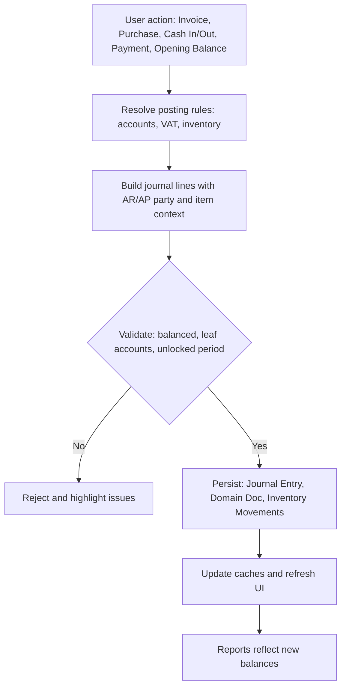

Comprehensive plan and design for a double-entry ledger (Config C)

Grounded analysis of current state
- Architecture: Offline-first React + TypeScript PWA with IndexedDB via Dexie and an optional MariaDB/Drizzle backend. See [Readme.md](Readme.md), [client/src/lib/db.ts](client/src/lib/db.ts), [client/src/lib/dexie-mariadb-adapter.ts](client/src/lib/dexie-mariadb-adapter.ts), [server/routes.ts](server/routes.ts).
- Current model: Single-entry tracking around customers/suppliers and cashbook in/out. No general ledger or chart of accounts. See [shared/schema.ts](shared/schema.ts) and [server/db/schema.ts](server/db/schema.ts).
- Pages: Cashbook is implemented as in/out without offset accounts. See [client/src/pages/CashBook.tsx](client/src/pages/CashBook.tsx).
- Issues to address:
  - No double-entry GL or Chart of Accounts.
  - No VAT handling.
  - Inventory is present conceptually but not tied to GL or COGS.
  - Multi-business framing exists in server schema but needs full propagation to client data and API payloads.
  - Client imports Shop in [client/src/lib/db.ts](client/src/lib/db.ts) but shared model uses Business in [shared/schema.ts](shared/schema.ts), causing a type mismatch.
  - Duplicate endpoints in [server/routes.ts](server/routes.ts).

Scope to deliver
- Multi-business, single-currency ETB, VAT 15 percent exclusive.
- Double-entry ledger with a chart of accounts and fully balanced journal entries.
- Product purchase and sale flows integrated with inventory (weighted-average costing).
- Opening balances (as of 2025-01-01) and ending balances by period.
- Debt insertion and debt repayment (AR/AP) with customer/supplier subsidiary ledgers.
- Reports: Trial Balance, General Ledger, AR/AP Aging, Inventory Valuation, Income Statement, Balance Sheet, VAT return.
- Offline-first UX with sync-adapter parity.

Domain model extensions
- General Ledger
  - gl_accounts: businessId, code, name, type asset/liability/equity/revenue/expense, parentId, isLeaf, isActive, description, createdAt, updatedAt, systemFlag.
  - gl_journal_entries: id, businessId, entryDate, memo, sourceModule cashbook/invoice/purchase/payment/inventory/migration/manual, sourceId, postedBy, postedAt, createdAt, lockedFlag.
  - gl_journal_lines: id, entryId, accountId, debit, credit, partyId optional for AR/AP, itemId optional, notes.
  - Invariants: sum(debit) equals sum(credit) per entry; posting to leaf accounts only; businessId scoping enforced.
- Inventory
  - inventory_movements: businessId, date, itemId, qtyIn, qtyOut, unitCost, value, sourceModule, sourceId.
  - Costing method: weighted-average per itemId per businessId; computed on movement.
- Tax
  - tax_rates: businessId, name VAT, rate 0.15, effectiveFrom, effectiveTo, isActive.
  - tax_codes: businessId, code, rateId, type output or input, scope sales or purchases, default flags.
- Config and rules
  - posting_rules: businessId, module, action, debitAccountId, creditAccountId, calc hints; seed defaults for Cashbook and Invoices.
- Opening balances
  - opening_balances: businessId, periodStart 2025-01-01, status draft/locked, memo; implemented as a single journal entry with many lines and AR/AP party details.

Posting logic map
- Cash In generic: Debit Cash or Bank; Credit chosen offset (e.g., Equity Owner Capital, Other Income, AR Customer).
- Cash Out generic: Debit chosen expense or AP Supplier; Credit Cash or Bank.
- Sale on credit (VAT exclusive):
  - Debit AR Customer: total including VAT
  - Credit Revenue Sales: net
  - Credit VAT Output: 15 percent
  - If inventory tracked: Debit COGS; Credit Inventory for weighted-average cost
- Sale cash:
  - Debit Cash/Bank: total including VAT
  - Credit Revenue Sales: net
  - Credit VAT Output
  - Inventory: Debit COGS; Credit Inventory
- Purchase on credit (VAT exclusive):
  - Debit Inventory or Purchases Expense: net
  - Debit VAT Input: 15 percent
  - Credit AP Supplier: total
- Purchase cash:
  - Debit Inventory/Purchases Expense: net
  - Debit VAT Input
  - Credit Cash/Bank: total
- Debt insertion (customer owes without invoice): Debit AR Customer; Credit chosen income or Other Receivable.
- Debt repayment: Debit Cash/Bank; Credit AR Customer.
- Opening balances (as of 2025-01-01): List balances per GL account and AR/AP party. Offsetting uses Opening Balance Equity to balance the entry if needed.
- Period closing: Optional; for small shops, reporting based on date range without closing entries; period lock prevents backposting.

Default chart of accounts (seed, per business)
- Assets: 1000 Cash on Hand, 1010 Bank A, 1020 Bank B, 1100 Accounts Receivable, 1200 Inventory
- Liabilities: 2000 Accounts Payable, 2100 VAT Payable, 2110 VAT Receivable optional if netting per jurisdiction, else separate
- Equity: 3000 Owner Equity, 3100 Opening Balance Equity
- Revenue: 4000 Sales Revenue
- Expenses: 5000 Cost of Goods Sold, 5100 Purchases, 5200 Operating Expenses

Key UX changes
- Chart of Accounts manager
  - Tree and list view, CRUD with safeguards on systemFlag accounts.
  - Per-business scoping; cannot post to parent accounts.
- Journal viewer
  - Filter by business, date, account, source; drill to entry and source document; show balanced debit-credit lines.
- Cash entry flow
  - Require offset GL account selection; optional Party selection; show journal preview before post; posts both Cashbook row and GL entry.
- Invoice and Purchase flows
  - Integrate VAT and inventory costing; on Approve, present journal preview; allow cash or credit; choose Bank for cash receipts or payments.
- Opening Balance wizard
  - Guided capture of GL balances and per-party AR/AP; creates one multi-line opening journal; lock state toggle with confirmation.
- Reports
  - Trial Balance, General Ledger, AR Aging, AP Aging, Inventory Valuation, P&L, Balance Sheet, VAT return. Date filters and business filter.

API and data layer plan
- Shared models: add zod models for GL, inventory movements, tax rates/codes, posting rules in [shared/schema.ts](shared/schema.ts).
- Drizzle schema and migrations: add GL, inventory movements, tax tables in [server/db/schema.ts](server/db/schema.ts) with a new migration 0001_add_gl.sql under [migrations/](migrations/).
- Seeding: add seed script to create default CoA and VAT 15 percent for each business; expose a bootstrap route for first-run in [server/routes.ts](server/routes.ts).
- REST endpoints in [server/routes.ts](server/routes.ts):
  - gl-accounts: GET list by business, POST create, PUT update, GET/:id
  - journal: POST create entry with lines (server verifies balanced), GET list with filters
  - posting endpoints: POST /post/cashbook, /post/invoice, /post/purchase, /post/payment; these compose and persist a journal entry and any related domain record atomically
  - reports: GET /reports/trial-balance, /reports/gl, /reports/ar-aging, /reports/ap-aging, /reports/inventory, /reports/pl, /reports/bs, /reports/vat
  - Fix duplicate cashbook endpoints and normalize payloads for businessId, currency ETB, VAT flags
- Client Dexie schema in [client/src/lib/db.ts](client/src/lib/db.ts):
  - Bump version; add stores for gl_accounts, gl_journal_entries, gl_journal_lines, inventory_movements, tax_rates, tax_codes, posting_rules; index by businessId, entryDate, accountId, partyId, itemId.
  - Resolve Shop import to Business from [shared/schema.ts](shared/schema.ts) and ensure businessId used across entities.
  - Extend HybridDatabase with typed accessors and fallbacks paralleling the MariaDB adapter.
- MariaDB adapter in [client/src/lib/dexie-mariadb-adapter.ts](client/src/lib/dexie-mariadb-adapter.ts):
  - Add REST methods for GL accounts, journal entries, reports, inventory movements, tax endpoints.
  - Include headers user-id and business-id consistently.

Core invariants and validation
- Journal entries must balance exactly.
- Posting only to leaf GL accounts.
- System accounts cannot be renamed/deleted; type cannot be changed.
- Business scoping required on all operations.
- Period locks enforced server-side; UI indicates lock status and prevents posting.

Mermaid: end-to-end posting flow

Migration approach
- Step 1: Lock period from 2025-01-01 and later during migration.
- Step 2: Compute customer and supplier net balances from existing single-entry records and cashbook up to 2024-12-31.
- Step 3: Create one Opening Balances journal (as of 2025-01-01) with:
  - AR per customer and AP per supplier lines
  - Cash/Bank opening per actual values
  - Inventory opening per counted value
  - Offset to Opening Balance Equity to balance
- Step 4: For any 2025 activity already present in cashbook/transactions, re-post via posting engine and deprecate the old single-entry views, or maintain a compatibility view that reads from journal.

Acceptance criteria
- CoA created per business; system accounts seeded and protected.
- Any user action that affects money results in a balanced journal entry with correct VAT and, when applicable, inventory COGS/Inventory lines.
- Cashbook entries require and persist an offset GL account; AR/AP flows reflect in subsidiary ledgers; invoices and purchases post VAT at 15 percent exclusive.
- Reports agree: TB debits equal credits; GL balances reconcile to TB; P&L and Balance Sheet reconcile; VAT report matches sales and purchases tax lines.
- Offline mode: All operations function without network using Dexie; sync adapter compatible with server when online.

Execution plan and milestones
- Phase 1: Foundations
  - Extend shared models and server schema; add migration; seed default CoA and VAT; fix client type mismatch; Dexie version bump and new stores.
- Phase 2: Posting engine and endpoints
  - Implement posting rules for cashbook, invoices, purchases, payments, opening balances; add server endpoints with validation; extend adapter.
- Phase 3: UI/UX
  - CoA manager; Journal viewer; Cash entry with offset; Invoice and Purchase posting preview; Opening balance wizard.
- Phase 4: Reports
  - TB, GL, AR/AP Aging, Inventory Valuation, P&L, Balance Sheet, VAT return.
- Phase 5: Migration tool and docs
  - Wizard for opening balances; guide and safeguards; documentation and tests.

Notable implementation details to watch
- Indexing: entryDate, businessId, accountId, partyId in GL; itemId and date in inventory movements.
- Weighted-average cost: update per movement; expose current average for each item and use it on sale postings.
- VAT edge cases: zero-rated items support later; rounding strategy 2 decimals; compute tax on line or invoice totals consistently.
- Duplicate endpoints: remove duplicates in [server/routes.ts](server/routes.ts) and centralize cashbook posting through the journal engine.

Request for approval
- This plan maps each requested capability to concrete data structures, flows, and deliverables, and is scoped for Config C.
- Once approved, implementation will proceed in the sequence captured in the project todo list.